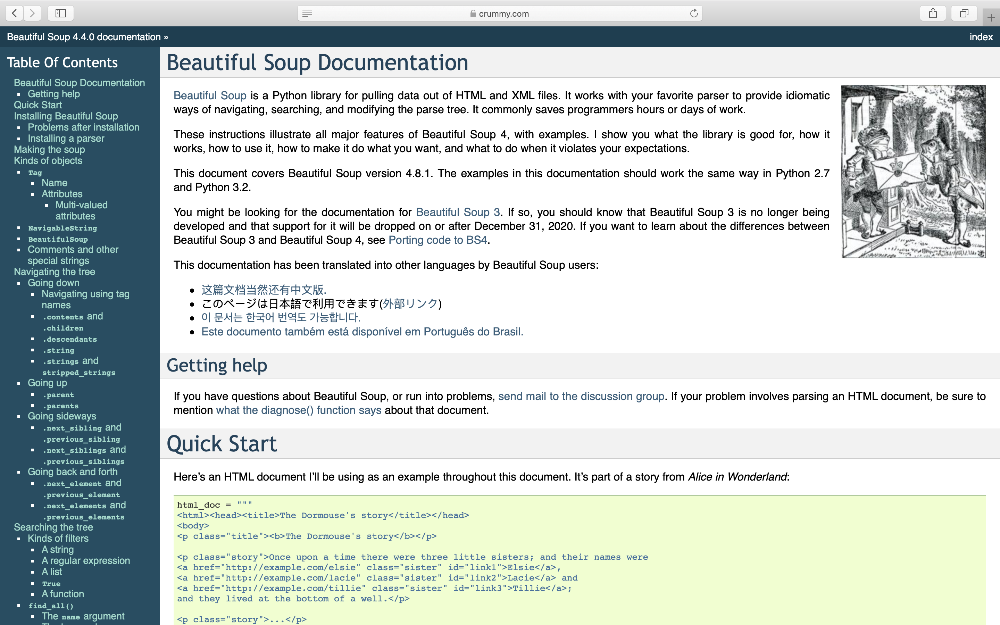

This week, we had Professor Deena Engel and Vicky Steeves come in as guest speakers to talk about open data. I took Deena’s Database Design and Web Implementation class in fall 2018, so I have some prior knowledge of public datasets and data manipulation. Nevertheless, I still learned a lot from the talk this Wednesday. 

## Fantastic Datasets and Where to Find Them
When taking Deena’s database class, we were encouraged to pick our own datasets for assignments. I remember spending quite some time looking for interesting datasets on [Kaggle](https://www.kaggle.com/), and here is one of the datasets I ended up using: [Video Game Sales | Kaggle](https://www.kaggle.com/gregorut/videogamesales). Although Kaggle is a great place to find open datasets, I’d love to learn about more sites with great datasets, so the question I added for Deena and Vicky beforehand was: “what are some best places to find good open datasets? “.  Vicky introduced [Awesome Public Datasets](https://github.com/awesomedata/awesome-public-datasets), which is a topic-centric list of high-quality open data sources. Compared to Kaggle, it has more specific categories, and it seems like the sources of the data are more reliable (I looked into several datasets under the category of healthcare). I will definitely consider using datasets from this list for future data science projects. 

## Licensing
 I’ve already learned about the importance of licensing for open source projects through the lectures this semester, and I further learned about the licensing issues for open data from the talk. In the past, I didn’t really pay attention to the licenses of datasets on the web, so I was surprised when I learned that you can actually filter by licenses on Kaggle. Vicky mentioned that in order to use data collected from social media sites like Facebook and Twitter, you will have to sign contracts with these big companies before use the data for research, and the companies will review your work before publication.  I wonder if this will harm academic freedom or compromise the integrity of the research. 

## Beautiful, Beautiful Soup
Deena and Vicky also introduced [Beautiful Soup](https://www.crummy.com/software/BeautifulSoup/bs4/doc/), a Python library for collecting data from webpages. As someone who works with web scraping a lot, I can’t imagine life without Beautiful Soup. When I first heard about it in Deena’s database class, I was reluctant to use it ~because the name kinda sounded like bs to me~. But after I actually started to use it, I was impressed by how powerful it is. Vicky said that she used to loop through the entire HTML to scrape data, and Beautiful Soup has made things 1,000 times easier. I believe this is no exaggeration.  

Deena mentioned that the name of Beautiful Soup might be an Alice in Wonderland reference, which explains the illustration and sample HTML content on the documentation page. 

I have always been curious about the name origin of Beautiful Soup, so I have done some research before on where the library got its name from. Another saying is that the library is named after the term [tag soup](https://en.wikipedia.org/wiki/Tag_soup), which is a pejorative for bad and incorrect HTML. No matter where the name came from, the name is still hilarious to me. I remember when writing a web scraping script one day, my friend saw the code and laughed at it. “`soup = BeautifulSoup(driver.page_source, ‘html.parser’)`? What is that code?” 

## Is Excel Bad?
Vicky brought up a really interesting case of [an Excel error that changed the history](https://www.bloomberg.com/news/articles/2013-04-18/faq-reinhart-rogoff-and-the-excel-error-that-changed-history), and the conclusion was that the Excel spreadsheet can be very unreliable. However, after reading more about the Reinhart and Rogoff controversy (e.g. [Is the evidence for austerity based on an Excel spreadsheet error? - The Washington Post](https://www.washingtonpost.com/news/wonk/wp/2013/04/16/is-the-best-evidence-for-austerity-based-on-an-excel-spreadsheet-error/) ), it seems like the Excel error itself was not fatal, and there are many other factors that have led to the flawed results. Though, with all the more advanced tools for data analysis available today, it does feel that Excel has become obsolete.
