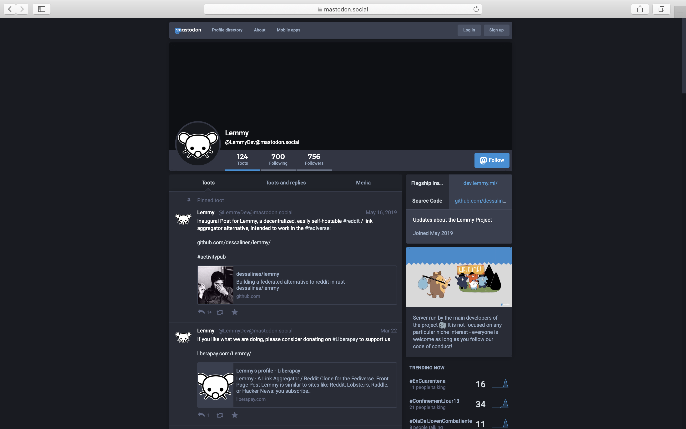

## Rebase Practice

I thought I was somehow familiar with Git; turned out to be not true. The rebase practice on Monday kinda stressed me out, like, I didn’t even know the git log graph should be interpreted from bottom to top. I thought I’ve learned and understood what rebasing is from the lectures before the spring break, but the practice this week made me realize that the concept is still fairly new to me. Although I’m quite comfortable with the command line, the rebase practice was still very challenging for me. I tried to produce the repository for several times, but each time the repository I got would look slightly different from the sample repository we were suppose to recreate, which was frustrating. I really should do more Git practices on my own and get more familiar with Git. 

What I would also like to mention is that working as a group via Zoom certainly has made things more awkward for me. Being the type of person with an introvert personality, I now have even less motivation (and courage) to talk when we are working remotely.

## Group Project
Our group has decided earlier to work on [Lemmy](https://github.com/dessalines/lemmy), an open-source alternative to Reddit as the project that we will be working on till the end of the semester. Unfortunately Charlie who proposed to work on Lemmy will not be available for some time, so it is now just Nishant and I who will be meeting and working as a group. (Update: Charlie is back! Such great news!) Nishant and I had our first Zoom meeting on Sunday to discuss the project and prepare for the meeting with Joanna. Although Charlie is the one who proposed the idea of working on Lemmy, Nishant and I are also very interested in the project. Both of us are excited to learn Rust, the primary programming language of the project which neither of us has any experience with. We first looked at the repository to figure out why Lemmy will be a good project for beginners like us. There are issues labeled as `good first issue`, and the maintainer of the project seems quite responsive to issues and people who are willing to help with the issues. The contributing guidelines  and installation instructions on the website are well-written and easy to follow. It also looks like there are opportunities to make contributions to translation and documentation, which are among the goals listed in my taking stock repository. 

We then decided to try to contact the maintainer of the project by sending an email like what some other group did, but we soon realized that the maintainer’s email was not listed anywhere. It turned out that the project uses [Mastodon](https://mastodon.social/@LemmyDev) and [Matrix](https://riot.im/app/#/room/#lemmy:matrix.org) as the primary contact methods. It was really interesting because Mastodon is like the open-source alternative to Twitter, while Matrix is like the open-source alternative to Discord. This really gave me an exciting feeling that we were in the open-source world! We quickly made accounts with Matrix and join the chat of project, and by browsing through  the recent chat history we figured that the community is quite friendly and willing to help, but they don’t welcome people with a bad attitude (someone just got banned for having a really demanding and terrible attitude). Nishant and I agreed to get involved in the chat once we actually start to work on the project.

Mastodon, the open-source Twitter

We then made a plan for working on the project as a group in the following weeks. For week 1, we will be getting familiar with the languages and tools of the project, trying to install the project on our local machine, and reading the source code. For week 2, we will be picking an issue to work on together and looking at translation/documentation opportunities. And for week 3 we will focus on the issue we’ve picked and try to make some progress. The plan looks quite solid to me, and I’m excited to start working on the Lemmy as a group!
