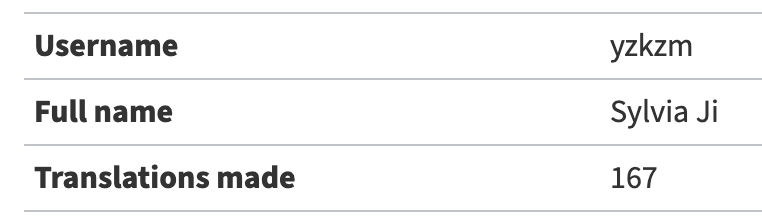

## Lemmy 

This week our group had a meeting to decide on the issues we would like to tackle. After browsing the issues tab of Lemmy together, we were interested in issue [#625](https://github.com/LemmyNet/lemmy/issues/625) which is to break out API files into their own modules since the API files are getting too long. We had a discussion on how should we reorganize the structs and functions based on their functionalities and which API files should each of us work on. However, after Charlie left a comment under the issue asking for more clarification, the maintainers replied that we should not try to work on this now as they don’t wanna do any reorgs until federation is mostly done.  

Another issue we looked at was issue [#639](https://github.com/LemmyNet/lemmy/issues/639) on back end code cleanup. Basically the maintainers would like to replace all the instances of `unwrap`, `is_some`, `is_ok`, `is_err` with `match` or `if let` to avoid crashing the program. This doesn’t look too difficult to work on and the maintainer also agreed that it would be a good first issue. I’ve been reading Rust documentation to get a better understanding of error handling in Rust. We will be having another meeting to take a crack at this issue soon, and I hope that we can make some progress.

I also helped with translating at [Lemmy’s Weblate](https://weblate.yerbamate.dev/projects/lemmy/) this week. I added/edited the translations of 160+ strings in both simplified Chinese and Japanese. 

Translating from English to my native language has been more difficult and time-consuming than I expected. It was hard to find an equivalent of “NSFW” in Chinese that does not sound strange to me. Meanwhile, I googled a lot when translating into Japanese in order to make sure that my translations sound natural. Thanks to the existence of Gairaigo (“loan word”, a transliteration into Japanese), I can simply translate “community” to “コミュニティ(komyuniti)” and “comment” to “コメント(komento)”, which had made things much easier for me. 
