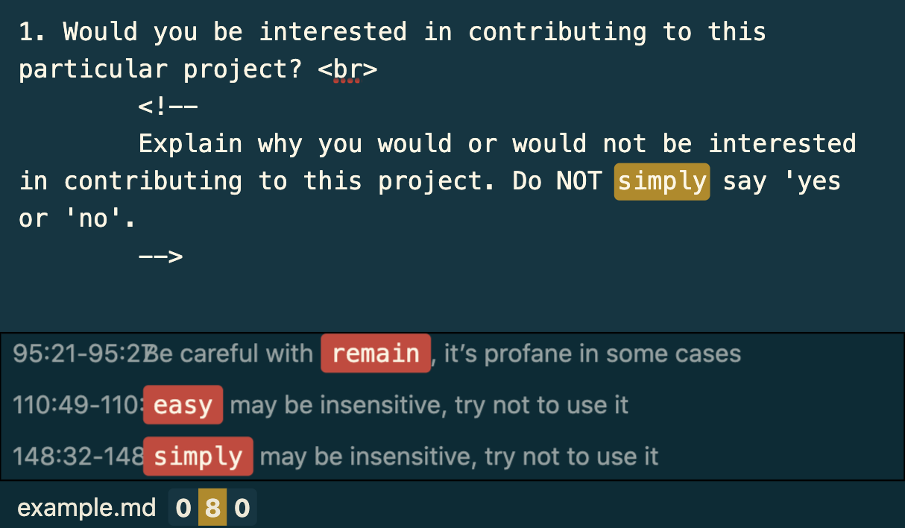
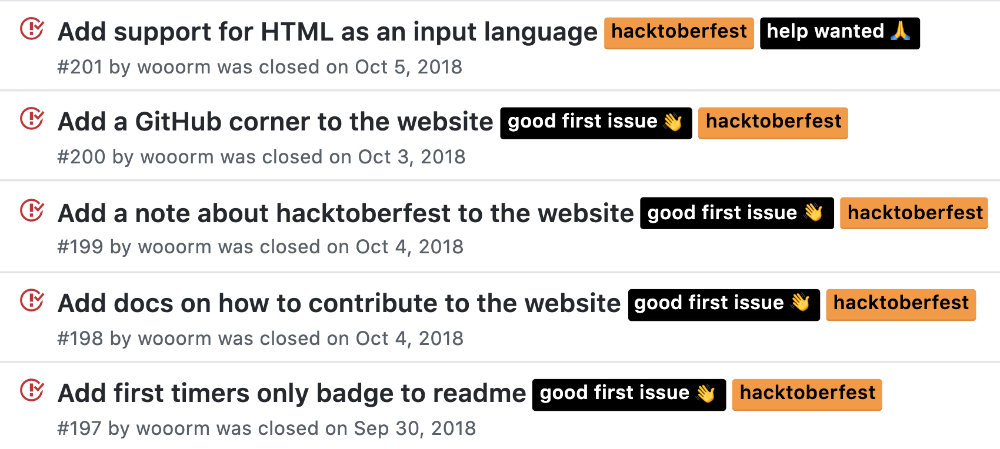
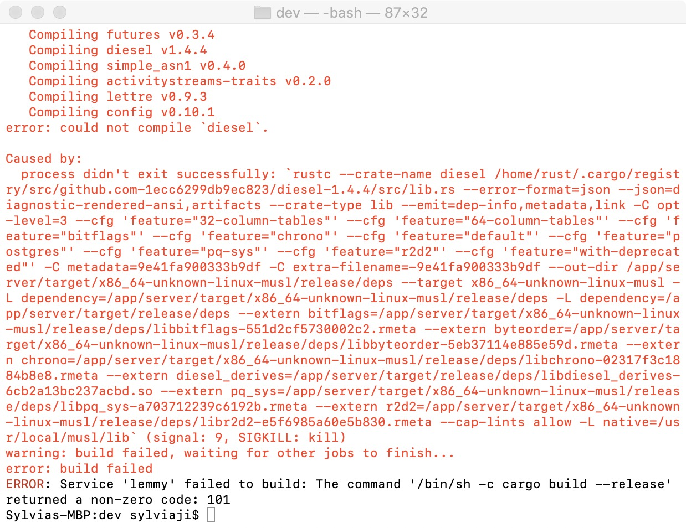
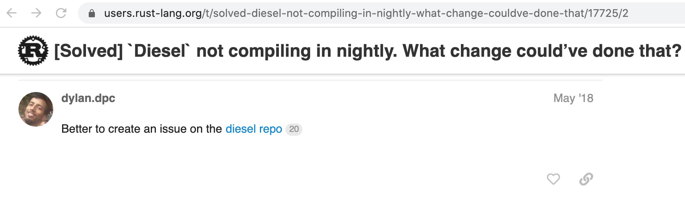
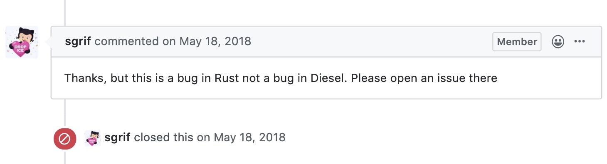

## HFOSS Continued
In Monday’s lecture, we continued our discussion on Humanitarian Free Open Source Software (HFOSS) and I had the opportunity to learn about a lot of cool humanitarian and social good projects. I was very interested in [Alex](https://alexjs.com/), a tool that catches insensitive, inconsiderate phrasing in markdown or plain text and was did a project evaluation of it with other classmates who were also interested in Alex. I copied and pasted the evaluation template into the [online demo](https://alexjs.com/#demo) and this was what I got:

Although not sure why “simply” may be insensitive, I was able to see how Alex can be a useful tool in writing. It seemed that the project was pretty active back in 2018, but not very active anymore. I also found that many closed issues have the label “hacktoberfest”, which is the event mentioned by Vicky Steeves earlier in the semester. These issues all look quite newbie-friendly and can be resolved in a relatively short time. Looking forward to this year’s Hacktoberfest!

I also liked [Tidepool](https://www.tidepool.org/users), a platform that aims to make diabetes data more accessible, actionable, and meaningful for both patients and clinicians. People with diabetes or those who are caring for someone with diabetes can use the platform to manage their diabetes data, while doctors and healthcare providers can use the data to help their patients. I understand that for chronic diseases data can be essential, and I’m interested in contributing to Tidepool or similar projects for other chronic conditions.

## Lemmy
For the past week I’ve been reading the Rust documentation and the source code of Lemmy trying to figure out how should I contribute to the code. But in this week’s lecture Joanna mentioned that in the past some students made the mistake of trying to understand the whole code base (which is not very possible). So I decided to start writing some actual code instead of staring at someone else’s code aimlessly all day long. I thought it wouldn’t be too hard to get the issue I’ve been looking at resolved; turned out I was naive. Unfortunately I ran into a huge blocker at step 1: set up the docker development environment. I kept running into the following error: 

I spent like a whole day trying to fix this (by googling) but so far none of the solutions I found online worked. I’ve been stuck in the infinite loop of : 1. copy & paste the error message and google; 2. try the solution found; 3. try to build again and wait forever; 4. build fails at the exact same place, which has been really frustrating for me. I’m planning to open an issue soon and hope someone in the community can offer some much needed help. 

P.S. what I found when trying to find a solution which made my day: 

