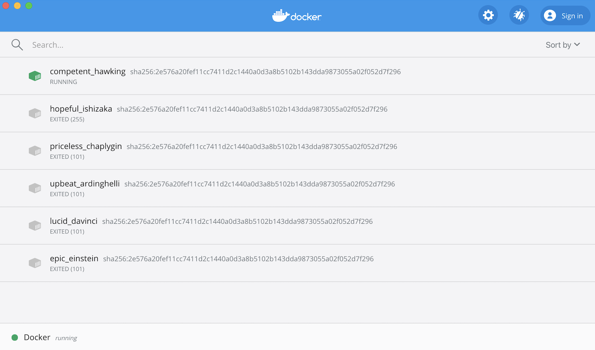

## Group Stand-Up Reports 2.0

This Monday we did the second round of group stand-up reports. We provided some updates on our contributions & the interactions with the community, and also what we expect to accomplish before the presentation. Charlie mentioned our attempt at this [API restructuring](https://github.com/LemmyNet/lemmy/issues/625) issue, and Joanna gave the suggestion to always leave a comment before trying to work on the issue. We will be doing our project presentation on May 11, and I hope that we can make more contributions by then.

## Lemmy Progress

### Docker Development
After spending days reading all the similar issues online and trying every possible solution out there (I was even doing that in my dream), I finally managed to fix the error I mentioned in last week’s blog post and build with Docker. It turned out to be an out of memory error just like what I thought in the very beginning (but then decided there was more than enough memory on my machine so that can’t be the issue). After running the [docker stats](https://docs.docker.com/engine/reference/commandline/stats/) command, I found out that only 2GB of space was allocated to Docker by default. I increased it to 4GB and the problem was solved immediately. It felt so good to see the container finally running after all the failed attempts:

### React is Hard :(
I mentioned [this issue](https://github.com/LemmyNet/lemmy/issues/601) on replacing the top menu in mobile view with a navigation drawer in my blog post 3 weeks ago and commented that it looked  “quite doable”. But when I actually started to work on it this week, it turned out the be way harder than I’ve expected. I was able to change the design the the menu according to the screen size, but I just couldn’t create a working navigation drawer. The navbar component looks simple, but the code behind it is quite complicated. I will continue working on this one if I have time before the class ends.

### Lemmy Cake Day!
This week someone suggested [adding the cake day feature](https://github.com/LemmyNet/lemmy/issues/682) to Lemmy just like what Reddit does, and the community eems to like the idea. So Nishant and I began to work on this fun issue. We started off by making a few birthday cake icons. I first tried to use [gravit.io](https://www.designer.io/en/) recommended by Nishant, but then figured that making vector graphics directly is a little bit hard for me. So I decided to make some png icons first and then turn those into vectors. I’m quite familiar with Adobe Photoshop, and since the school is now closed, I started a free-trial of the Adobe Creative Cloud and was planning to get everything done within 7 days. But I later found out that Adobe is now granting [temporary Adobe Creative Cloud access for NYU students](https://nyu.service-now.com/servicelink/kb_search.do?id=KB0018090) which is super cool (to be honest, it feels much better to work on my personal laptop than working on some Bobst computer). Here are the ones that I’ve made:

I’ve also been looking at the front-end code related to this issue. I managed to show  the user’s cake day on the profile page, but I’m still trying to figure out how to determine if it’s the user’s cake day today and add a small cake icon next to the username. I will be discussing with my groupmates and I hope to get this done by the end of next week.

### Translations

Nishant raised an issue about adding a new language to Weblate, and the maintainer was very helpful. I’m also thinking about suggesting more languages on Weblate. I just suggested traditional Chinese, and I think I should be able to finish all the translation work soon given that the progress for simplified Chinese is now 100%. I’d also like to suggest Korean, but I’m not quite sure if my Korean is good enough to do the translation (with some help from Google Translate, maybe…?) Anyway I will try to finish the translation for traditional Chinese first!
